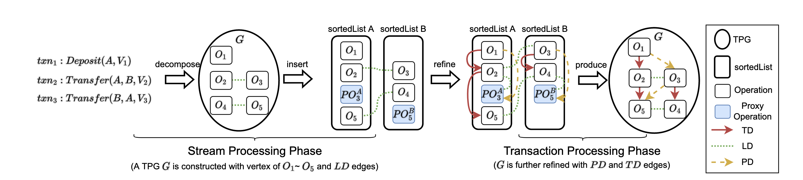

# Transaction Processing Graph

[toc]

---

TPG is a model using graph to guide scheduling operations.

Using Graph to schedule the execution of multiple threads is a great idea. Since:
1. **Paths join like threads syncs**. Joint nodes (Synchronize) in some certain points while most of the time running async (Different paths).
2. **Expressive for dependency and possibility**. Branches are suggesting possibilities of different scheduling strategies; connected edges constraints and navigates.
3. **Markable Map**. Graph is suitable to make all kinds of marks to guide the traversal, which can be used to construct some kind of sequence.
3. **Easy to split and parallize**. Graph with fruitful algorithms provides various tools to plan and divide. Helps to model planning formally and mathematically.


## Construction



The system assumes a series of transactions streaming in.
```golang
ReceiveStreaming <- []txn{
	[]Operations
	TimeStamp
}
```

## Traversal

After construction of TPG, we need to traverse in parallel and operates each node. These nodes (Operations) are connected by some edges suggesting the dependency. Including:
- `TD` (Temporary dependency). Organized by timestamps in each transactions.
- `PD` (Parameter dependency. e.g. we need to perform `Write(B, f(A))`, then we need some version of A to get `f(A)` to update B. PD marks this dependency) .
- `LD` (Transactional dependency). Marking variables that need to be rolled back in protection of transactional semantics.

And we mark these nodes in four status:
- `RDY`: ready to be operated but not yet.
- `EXE`: Operation done.
- `BLK`: Dependency not fulfilled. It would be turned into `RDY` after all the dependency executed.
- `ABT`: Failure happens. Requires to be rolled back.

To avoid repeating node, we added the fifth status `OCCUPIED` to prevent the `RDY` nodes to be pushed to stack more than once. This is differ from original morhStream.

We are going to start from some points to traverse through this TPG, transitioning status of each node. 

After successful construction, there are three kinds of TPG nodes in the graph:
```
(TD, RDY). Status is Ready, and would be visited by TD;
(TD, RD, BLK). Status is blocked, can be visited by TD and RD;
(RD, BLK). Status is blocked, can be visited by TD and RD;
```

I'm introducing two methods of traversal. Before that, I need to prove some lemmas.
### Conclusions For TPG Traversal

There are some quite intuitive characteristics:

1. The node we can start from features:
   - Must be the first node in the list of each status.
   - Dependency must be empty.
2. From the starter nodes above, each node can be visited through PD and TD with proper DFS.
	```
	IF [there are some isolated node of status X] then
	1. It's the first Operation of Status X with No dependency: It would be visited as Starter.
	2. It's the first Operation of Status X with dependency: According to lemma 3, it must have a ancient with no dependency.
	3. It's the later operation of status X: It would be visited after its TD parent.
	SO [The Conclusion Holds]
	```
3. There could be more than one path from one node to another, but there is no circle if the transaction itself is executable.
	- Reason: TD and PD are both directed from the earliers to the laters. The only possibility of loop is multiple operations depends on each other in one single transaction, which is the user's responsibility to write logical transactions.
	- So: we need to prevent repeated visit but no need to worry about dead lock or dead loop.

### Pure DFS

Quite intuitive. Explanation omitted.

Points:
- `PUSH`/`POP` could be expensive. Be sure to execute each node we `PUSH`ed.

Cost:
- Stack Space and `PUSH`/`POP` cost. The stack could not be avoided for the possibilities of graph traversal.
  - `TODO`: Reallocation of quite long stack may be optimized with linked list or something. Empirical size of stack could be predefined to avoid copy expansion.
- Visiting memory each movement to check the status. (According to morphStream paper)
  - `TODO`: Actually a little bit confused..

Drawbacks:
- Imbalance between threads. Length of status operations is unpredictable and varies a lot.

### Notified DFS

A modification of DFS that allieviate imbalance of threads through communication.

Idea: 
- When a thread is traversing to some `BLK` nodes, it could choose to register a channel to subscribe the later notification of the nodes' being ready. So, when the node is turned to `RDY`, the node could choose to be executed in which thread.
- Transfering one node could be transfering a series of later nodes. Theoretically, I believe it would work well in most cases.

Details:
- When to register the channel? 
  - Depends on the burden. i.e. the length of stack. Shorter stack means higher possibility to be idle and wait for transfering.
- When the node is ready, how to decide dispose locally or send to the subscriber?
  - Always try to send to the subscriber. If subscriber accept, it's making use of a idle thread. And cost is low.

Cost:
- Almost zero. Fractional cost including trying out send through channel and subscribe by putting the pointer of channel to the node on TPG.

## Rolling Back when Transaction fails

The system provide transactional semantics, ensuring each transaction to be commited or be aborted totally.

### Happening Condition

Fault only happens when:
- Some operation in some transaction throws error on purpose. Fault and transaction abortion only happens in App layer.

```golang
if err := Operation.Do(); err != nil {
	// Handle revert here.
	...
}

// What the Operation.Do() actually does:
func Do(target ParamView, params ParamView) error {
	if deposit := params.Get(1); deposit < transferValue {
		return errors.New("no enough balance")A
	} else {
		...
		return nil
	}
}
```

Fault won't happen by:
- `Set` and `Get` methods provided by the Storage engine. For simplicity, the schema and type for all the status are fixed without dynamic allocation, so no error would happen this layer.
- Failure of some thread or instance. It's a single node TSPE, all the failure in Operation system layer or Hardware layer shall directly panic the program.

When some operation in some certain transactions return an unnil error, the reversion triggered.

### Desired Conditions

When some abortion happens during traversal of TPG:

1. There must be some nodes of status `RDY` `OCCUPIED` as well as some at `EXE` even `ABT`.
   - So we need to continue traversal to finish those healthy transactions. The course of healthy traversal and abortion traversal must be interweaving.
2. For Atomicity required by ACID, we need to revert transactions as a whole.
   - We must use `TD` in TPG to set all to `ABT`.
3. Some transactions shall be reverted:
   - The very transaction with error operation.
   - The latter transactions depending on any modification in this transaction.
4. We shall keep those healthy transactions continue till end. 
   - All the transactions beside these two in point 3 shall be executed.

After abortion we want to:
1. All the node shall be aborted is marked as `ABT`.
2. Report the list of aborted transactions.
3. Report the last available version of each state for storage engine to revert.

Here we introduce some intermediate conclusions supporting solutions:
1. Working on the nodes that is going to be marked as `ABT` is wasting but does no harm.
   - So we can let it happen but needs to minimize this condition. We can't forsee the node is going to be aborted when it's not marked, but we need to know as soon as possible.
   - So `ABT` thread (thread that is marking `ABT`) and normal working threads could work simutaneously, no need to stop; as these two stage are independet, they can be switched easily.
2. A state could hold a newer version of valid value with older version `ABT`. It can only happen when all its parametric dependencies lie in valid transactions.
   - So by exploring each PD of states, we can visit any valid version. When coming across `TD` nodes of `ABT` status, we can just stop.
   - We need to delete versions of states one by one.
3. Without guided messaging or coordination, a normal thread coming across `ABT` nodes could not help marking `ABT` from that point. 
   - The related node of that `ABT` node could have been marked or not. Traversal only wastes.
   - `TODO`: Any better idea for these working threads, to accelerate but more than just doing possbly wasted operations?

So there are some guidelines for solutions:
- Mark `ABT` as quick as possible. Introducing mechanism for parallelism is considerable.
- No turning back to check `ABT` for normal threads. Just stop at `ABT`.

### Solutions for Rolling Back

When some thread comes across error arising:
- Switch the current working from traversal to marking `ABT` immediately.
  - Traverse along with `LD` and `PD`. Go to the head of `LD` when going into a new txn; and when traversing through the `LD` line, collect `PD` into stack.
  - Mark any of the nodes as `ABT` and revert the storage.
  The traversal could meet:
  ```
  (LD/PD,RDY/OCCUPIED/EXE). The node arrive by LD/PD, and status normal. Just mark and revert.
  (LD,ABT). Another abortion is working in progress or has been done. Stop since this transaction will be or has been marked. 
  (PD,ABT). Another abortion is working in progress or has been done. Stop since this transaction will be or has been marked. And its dependent transactions will be, too. So no need to continue this branch.
  ```
  - When marking complete, return to normal traversal as other threads does.

Normal threads may come across `ABT` when working. Do:
- Check the status and stop marching on the `TD` when coming across the `ABT` node from `node.TD` and from POPing the stack.
- Check the status and stop PUSHing to stack when finding new `ABT` node from `node.PD`.

### Possible promotions

- Message to coordinate the normal threads when fault happens. Make them concurrently marking `ABT`.

## Limitations

### High latency introduced by Batch disposal. 

Now we construct TPG in punctuation style, waiting for some interval and then perform decomposing in **Batches**. 

This brought us some troubles like:
1. We need to manually maintain the hyperparameter `punctuation` .
2. Introduce latency for fixed punctuation. Despite its huge throughput, it's not so adaptable in network conditions with low latency demands.

However, as the fact below, we can't choose to build it `streamingly` if blueprint not changing significantly:
1. For some reason like network delay, thread asynchronicity, the txns are arriving in times. And we need to finish the disposal after the last one arrives, which can't be shortened.

### Limited Operations

 The only ideal operation supported is `W(Target, f(...Params))` which features aggresive and shall be heavy enough to amortize the cost of other mechanism overhead, making it suitable for heavy status calculations like stream disposal but not generally "managing shared status".